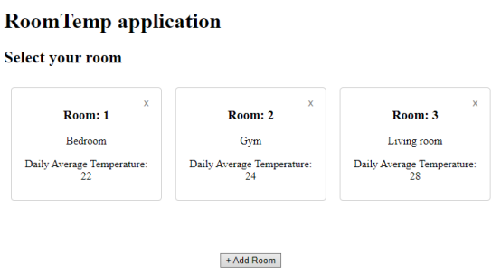
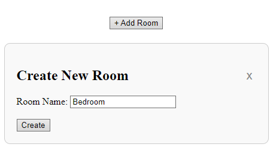
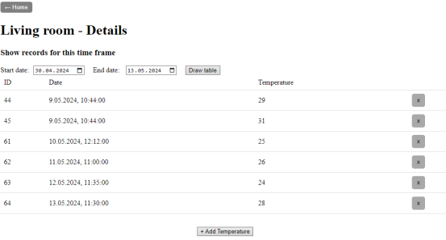
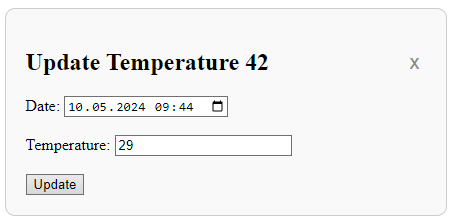

# Flask room temperature website

## Overview

---

This Flask website project facilitates users to create rooms with custom names and 
record temperatures measured within them. Additionally, it offers functionality to 
modify, update, and delete records and rooms. The project's primary objective was to 
develop a web application where the database and server hosting the website are distinct 
entities, achieved through the utilization of a RESTful API. While the database structure 
and layout design are not extensively elaborated, they are meticulously crafted to ensure 
high operational efficiency, aligning with the project's overarching focus on API creation 
and utilization.


## How It Works

---

The main page of the website displays information regarding the available
rooms along with their respective daily average temperatures. Users have 
the option to select a specific room to view detailed information, create 
a new room, or delete an existing one. Upon selecting a room for detailed 
insight, users are presented with a table showcasing the temperatures recorded 
within the room during the requested period. This interface enables users to 
seamlessly add, modify, or delete temperature records as needed.


## Getting Started

---

### Prerequisites

---
* Python 3.x
* flask
* python-dotenv
* psycopg2
* requests
* flask-cors


### Installation

---
1. Clone the repository:
    ```
    https://github.com/Janasu97/flask-room-temperature-website-with-restful-api.git
    ```
2. Navigate to the project directory.

3. Install the required Python packages:

    ```bash
    pip install -r requirements.txt
    ```

4. Ensure to supply the .env file with the necessary connection 
details to access the database utilized by the application. 
This includes providing credentials such as the 
database username, password, host, and port.

5. Start the RESTful API by running the api.py script.

6. Initiate the Flask application either by using the terminal 
command flask run while in the project directory or by directly 
running the web.py script.

    ```bash
    pip flask run
    ```

7. Alternatively, if you have Docker installed, you can easily create images 
and containers for both the web app and API. Navigate to the directory 
containing api.py and execute:

    ```bash
    docker build -t api-app:1.0 .
    docker run --name api-container -d -p 5001:5001 api-app:1.0
    ```
    For web application go for its directory and type:
    ```bash
    docker build -t web-app:1.0 .
    docker run --name web-container -d -p 5000:5000 web-app:1.0
    ```

## Usage

---
Upon confirming that both the API and web application are operational, 
proceed by opening your web browser and navigating to the designated HTTP address, 
typically http://127.0.0.1:5000. This action will redirect you to the main page, 
which presents an organized list of available rooms.



From here, users can initiate the creation of a new room by utilizing the "Add Room" button. 



Existing rooms can also be managed effortlessly; to remove a room, 
simply click the 'X' icon positioned in the top-right corner of the 
room rectangle. For room modifications, click anywhere within the room 
rectangle except for the delete button. Upon accessing the detailed page of a room, 
users can explore the recorded temperatures within the specified timeframe.



Adding a new temperature record is achieved by selecting the "Add Temperature" button.


For existing temperature records, users have the flexibility to delete 
them by clicking the 'X' symbol situated on the far right of the record's row. 
Additionally, records can be modified as needed.




## Contributing

---
Contributions are highly encouraged! This project boasts significant 
potential for enhancements, ranging from refining the layout for enhanced 
visual appeal to augmenting functionality and introducing additional pages. 
Should you encounter any issues or have suggestions for improvement, please feel 
free to open an issue or submit a pull request. Your input is immensely valued 
and contributes to the continuous refinement and enhancement of this project.


## Authors

---
Jakub J.
